# Comenzar a usar Andino

<!-- START doctoc generated TOC please keep comment here to allow auto update -->
<!-- DON'T EDIT THIS SECTION, INSTEAD RE-RUN doctoc TO UPDATE -->
## Indice

- [Primeros pasos](#primeros-pasos)
- [Entrar y salir de tu portal](#entrar-y-salir-de-tu-portal)
- [Permisos de usuario](#permisos-de-usuario)
- [Elementos de tu portal](#elementos-de-tu-portal)
    - [Organizaciones](#organizaciones)
    - [Sección Organizaciones con datos](#seccion-organizaciones-con-datos)
    - [Sección Acerca](#seccion-acerca)
    - [Temas](#temas)
    - [Datasets](#datasets)
    - [Recursos](#recursos)
    - [Campos de un recurso](#campos-de-un-recurso)
    - [Series de tiempo](#series-de-tiempo)
    - [Etiquetas](#etiquetas)
    - [Personalizar el portal](#personalizar-el-portal)
- [Integrar Andino con Google Analytics](#integrar-andino-con-google-analytics)
- [Consultas sobre Andino](#consultas-sobre-andino)
- [Otros contenidos útiles](#otros-contenidos-utiles)

<!-- END doctoc generated TOC please keep comment here to allow auto update -->

## Primeros pasos

**¡Un aplauso, ya estás abriendo tus datos!**

Esta guía te ayudará a:

* Conocer los elementos del catálogo e identificar dónde se ven en el portal.
* Personalizar el portal.
* Crear datasets, recursos, organizaciones y temas.
* Asignar permisos de usuarios. 
* Integrar con Google Analytics.


<p align="center">¡Arranquemos!</p>

***

## Entrar y salir de tu portal

**Cada vez que quieras entrar al portal, podrás hacerlo desde http://*tu-url.com*/ingresar**.

<center>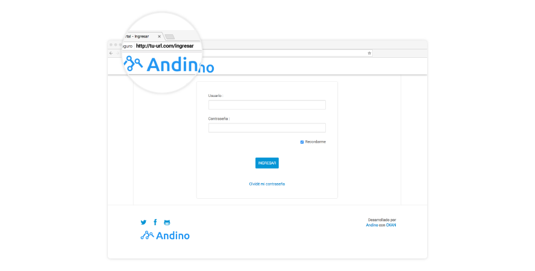</center>

***

## Permisos de usuario

Desde agosto de 2017, en Andino **hay dos tipos de usuarios: los administradores y los colaboradores**. El primer usuario administrador siempre es creado por el técnico en sistemas que instaló Andino. 

**Los administradores de Andino pueden invitar a más personas a colaborar** en la apertura de datos, **eligiendo el tipo que quieren asignar**:

* **Administrador**: podrá crear usuarios, editar la configuración general del portal; crear, actualizar y borrar todos los datasets; y gestionar temas y organizaciones. 
* **Colaborador**: podrá crear, actualizar y borrar datasets sólo de las organizaciones que tenga asignadas (por eso es importante que primero crees en tu Andino las organizaciones en las que necesitás colaboradores). 

**Asigná permisos desde Mi cuenta > Crear usuarios**.

<center>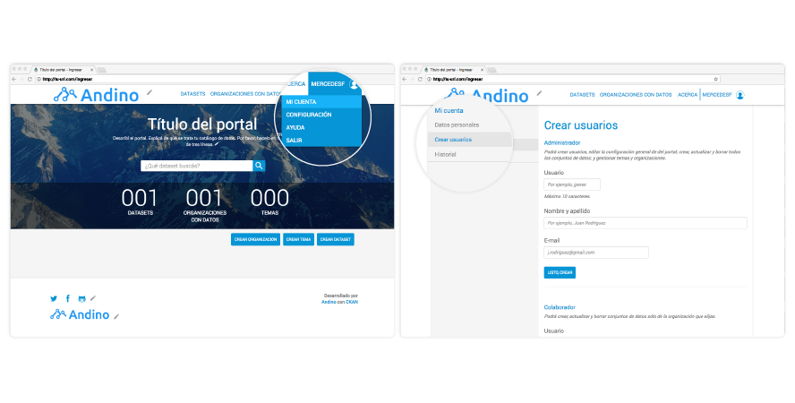</center>

***

## Elementos de tu portal

### Organizaciones 

Son los organismos que abren o mantienen cada dataset. **Es muy importante que crees las organizaciones antes de que generes un dataset** que esté asociado a ella. 

##### ¿Dónde lo veo en el portal?

* Como uno de los filtros de la vista de Datasets.
* Como número agregado, en la Página principal de tu portal, en caso de que hayas elegido la vista que muestra el número de Organizaciones con datos.

<center>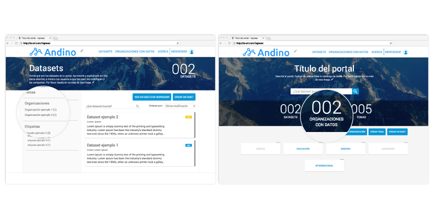</center>

##### Buenas prácticas al crear Organizaciones con datos

Tené en cuenta que **siempre que borres una organización, todos los conjuntos de datos (y también los recursos), se borrarán** definitivamente. 

##### ¿Cómo los creo?

Andá a **Página principal > Crear Organizaciones**.

<center>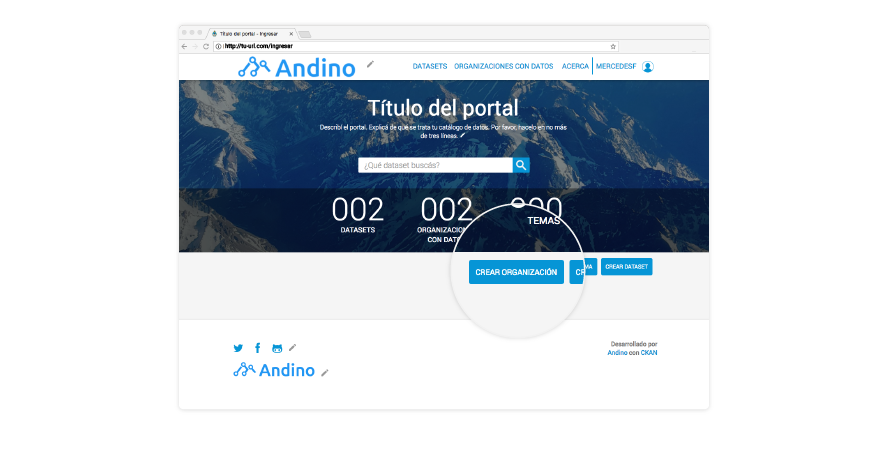</center>

En caso de que hayas elegido que tu portal tenga una sección de Organizaciones con datos, también se mostrarán allí. 

<center>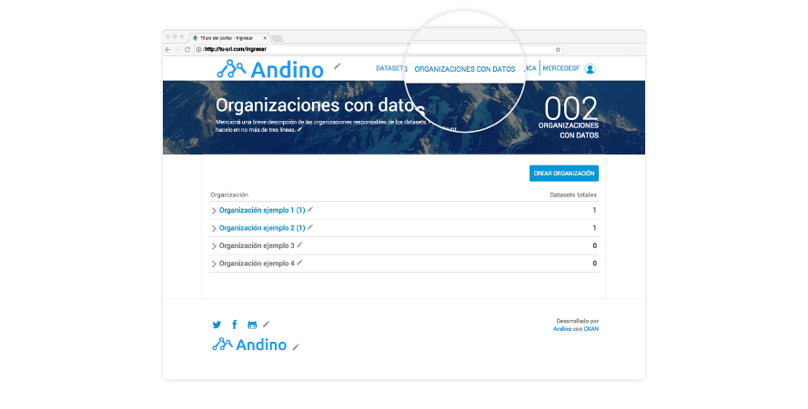</center>

***

### Sección Organizaciones con datos

**Esta sección es opcional**. Te permite armar un árbol de jerarquías con las organizaciones que abrieron datos en tu portal. Los organismos que se muestran en esta parte de tu portal son los mismos que asignás a los datasets y que creás antes de generar estos últimos. 

##### ¿Dónde lo veo en el portal?

En Página principal > **Organizaciones con datos**.

##### Buenas prácticas al crear la sección Organizaciones con datos

Es importante que tengas bien en claro qué organizaciones dependenden de otras, para que el árbol de jerarquías represente bien las correspondencias. 

##### ¿Cómo las creo?

Como la sección Organizaciones con datos es opcional, podés elegir que se vea en tu portal. Para eso, **andá a Configuraciones > Organizaciones con datos** y tildá la habilitación. 

<center>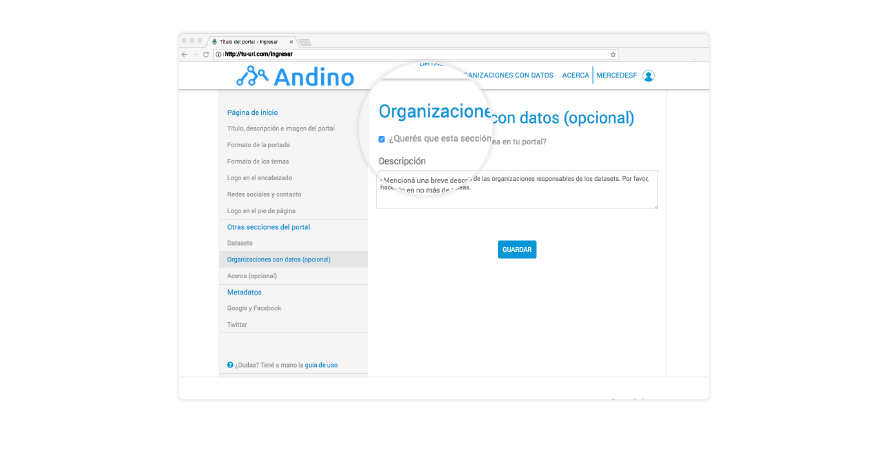</center>

***

### Sección Acerca

**Esta sección es opcional**. Te permite darle la oportunidad a los usuarios que naveguen tu portal de leer información del mismo para un mejor entendimiento.

#### Tipos de Acerca

Existen tres tipos diferentes que vas a poder elegir:

* **Sin sección de acerca**: para cuando se decida no mostrar información.
* **Sección con información básica**: existirá un botón que lleve al usuario a una página donde encontrará información básica sobre el portal (un título y una descripción). Estará ubicado en Página Principal > **Acerca**.
* **Secciones personalizadas**: se crearán varias secciones personalizadas que vas a poder modificar a gusto. El botón Acerca ahora desplegará un menú que contendrá todas y cada una de las secciones que hayas añadido al portal. Para cada sección, se necesitará un archivo (de formato .html) con el contenido que quieras mostrar.

#### ¿Cómo elijo el tipo de Acerca?

Andá a Página Principal > Usuario > Configuración > **Otras secciones del portal > Acerca (opcional)**

<center>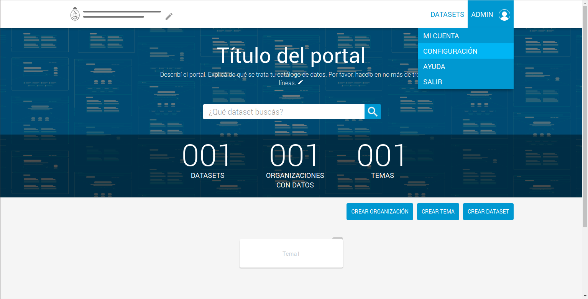</center>

<center>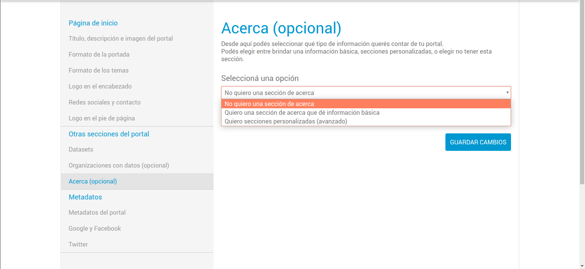</center>

#### ¿Cómo puedo escribir y mostrar información básica?

Habiendo elegido la **segunda opción**, podés modificar el título y la descripción.

<center>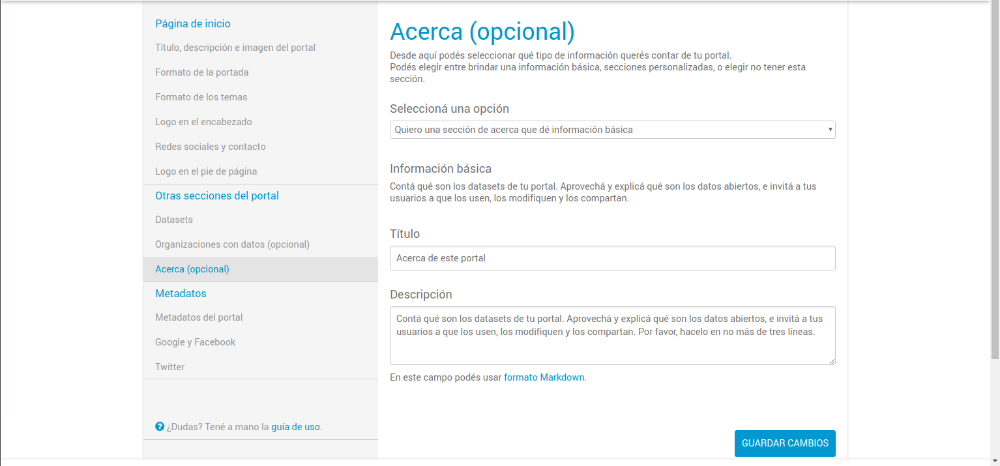</center>

#### ¿Cómo puedo crear y mostrar mis secciones personalizadas?

Habiendo elegido la **tercera opción**, podrás ir creando tus secciones escribiendo un título y un nombre de archivo. Recordá que, para cada sección, será necesario guardar un archivo (de formato .html) para que el portal pueda mostrar su contenido.

<center>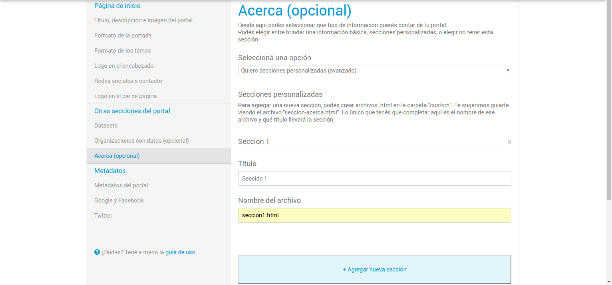</center>

#### ¿Dónde añado los archivos requeridos para las secciones?

Dentro del container, dichos archivos deben ser guardados en el directorio **/var/lib/ckan/theme_config/templates/** .

De no existir la carpeta **/templates**, se deberá crearla utilizando dos comandos:

* mkdir /var/lib/ckan/theme_config/templates
* chown www-data:www-data /var/lib/ckan/theme_config/templates/

(www-data es el usuario con el que se corre el proceso apache en el sistema operativo **Ubuntu**)

Dentro de cada archivo deberá estar el contenido de su sección correspondiente. Por favor, **no te olvides** de que el nombre del archivo **debe coincidir** con lo escrito en el campo 'Nombre del archivo' de la sección.

#### ¿Dónde y cómo puedo guardar imágenes para mostrarlas en mis secciones? ¿Cómo las muestro en mis templates?

Dentro del container, las imágenes deben ser guardadas en una carpeta llamada "user_images".

Para poder copiar y pegar una imagen en dicha carpeta existe un comando que podés usar, pero primero tenés que hacer tres cosas:

* Dentro del contenedor, ejecutar este comando:

```
chown www-data:www-data /usr/lib/ckan/default/src/ckanext-gobar-theme/ckanext/gobar_theme/public/user_images/
```

* En caso de que hayas cambiado manualmente el puerto del contenedor, saber cuál es (el default es 8080)
* Tener preparado el nombre del contenedor (ya que queremos decirle al comando en qué lugar vamos a guardar la imagen)

El nombre del contenedor se consigue escribiendo en una terminal dentro del host: 
```
sudo docker-compose -f latest.yml ps |grep <puerto del container>
```

Sólo nos queda guardar la imagen:
```
docker cp <nombre de la imagen> <nombre del contendor portal>:/usr/lib/ckan/default/src/ckanext-gobar-theme/ckanext/gobar_theme/public/user_images/
```

Supongamos que guardaste una imagen llamada 'mi_imagen.png'; para poder utilizarla, podés escribir dentro de tu template esta línea (completa): 
```

```

***

### Temas

Son las categorías en las que se pueden clasificar todos los datasets de tu portal. Hay dos taxonomías de temas:

*  **Temas globales**, que ya vienen con Andino, y que necesitás elegir para cada dataset. Estos temas no se ven en tu portal, pero es necesario que lo elijas para que el portal nacional datos.gob.ar pueda republicar el dataset según esta clasificación. Por ejemplo: "Economía y finanzas".
* **Temas específicos**, que son opcionales, pero que te recomendamos con énfasis que agregues a todos tus conjuntos de datos porque son los temas que van a ver tus usuarios. Por ejemplo, si el tema global era "Economía y finanzas", un tema específico podría ser "Compras".


##### ¿Dónde lo veo en el portal?

* En la Página principal de tu catálogo de datos. 
* También como detalle de cada dataset específico.

<center>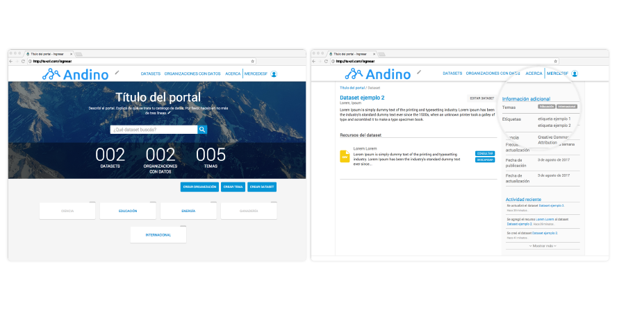</center>

##### Buenas prácticas al crear Temas específicos

* Intentá crear los temas específicos a conciencia para poder reutilizarlos a futuro. 
* No crees un tema específico por cada dataset.
* Asegurate de que cada tema específico sea un aparte más pequeña dentro de los Temas globales. 

##### ¿Cómo los creo?

**Andá a Página principal > Crear tema**. 

<center>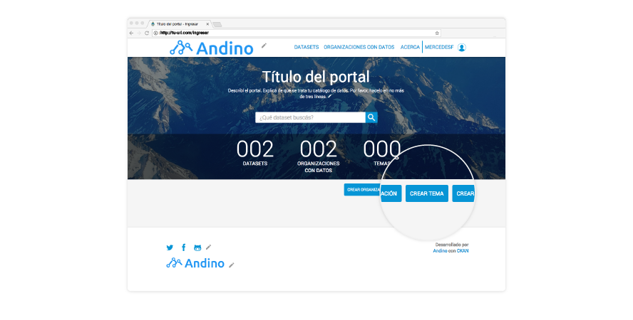</center>

##### ¿Cómo los asigno?

**Cada vez que generes un nuevo dataset**, el formulario te pedirá que asignes temas. Recordá siempre reutilizar los que ya hayas creado y no repetirlos.  

<center>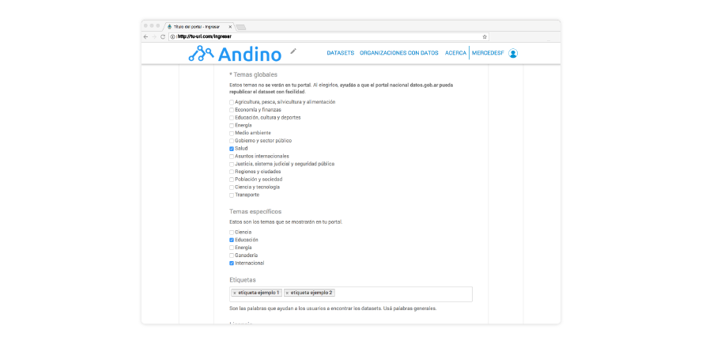</center>

***

### Datasets

También los llamamos "conjuntos de datos". Son la pieza principal de tu portal o catálogo de datos. Cada dataset está formado por uno o más recursos. 

##### ¿Dónde los veo en el portal?

Todos los datasets que subas al portal se verán **en la sección Datasets**. Además, **podrás destacar** los que creas más importantes en la Página principal.

<center></center>

##### Buenas prácticas al crear datasets

* **Títulos de los datasets**: es el primer vistazo que los usuarios tendrán sobre su contenido. Por eso, intentá no superar los 100 caracteres. Prestá especial atención a las mayúsculas. Sólo los sustantivos propios las necesitan. 
* **Descripción de los datasets**: es el detalle que le contás a los usuarios. Por esa razón, es importante que trates de dar una explicación general de los datos con los que se va a encontrar. Intentá no superar los 500 caracteres.

##### ¿Cómo los creo?

Ingresá a tu cuenta y andá a **Página principal > Crear dataset**.

<center>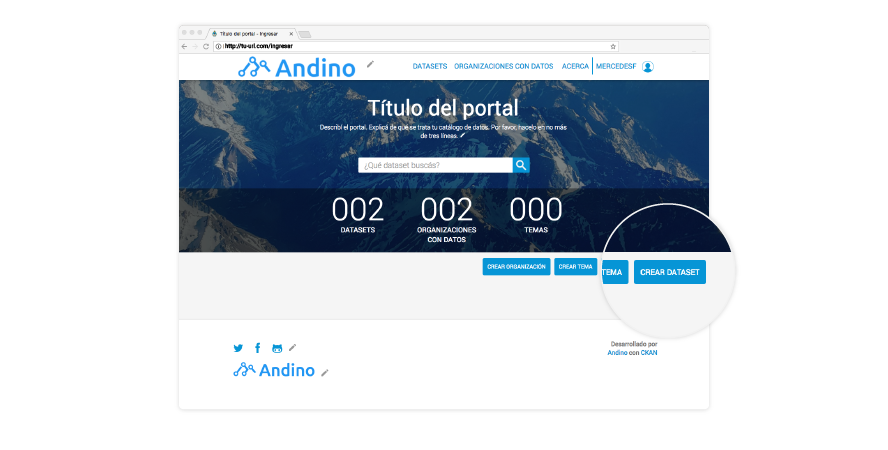</center>

**Siempre podrás editar los dataset** que hayas creado. Para eso, ingresá a tu cuenta > Página principal > Datasets > **Editar dataset**. 

***

### Recursos

Cada dataset está formado por, al menos, un recurso. Por eso decimos que los recursos son la pieza de información más pequeña del catálogo y los verdaderos activos de datos del portal. 

#### ¿Dónde los veo en el portal?

Página principal > Datasets > Clic en el recurso específico.

#### Buenas prácticas al crear recursos
Seguí los mismos criterios de escritura que con los datasets. 

* **Títulos de los recursos**: intentá no superar los 150 caracteres.
* **Descripción de los recursos**: intentá no superar los 200 caracteres.

#### ¿Cómo los creo?

Ingresá a tu cuenta y andá a Página principal > Crear dataset. Una vez que completes el dataset, podrás agregar recursos. 

<center>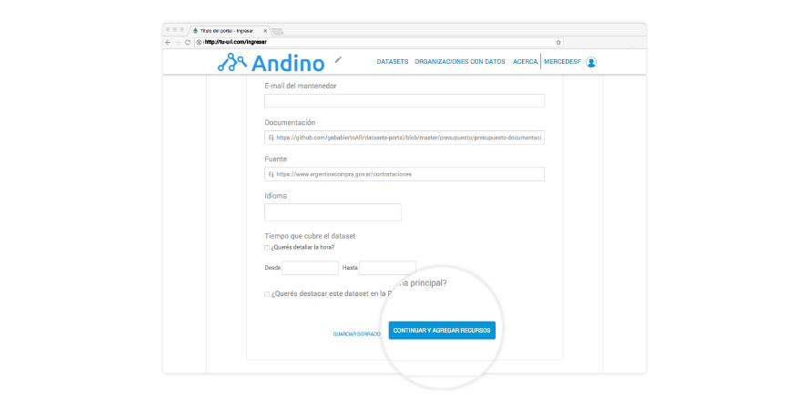</center>

Al igual que con los datasets, siempre podrás editar los recursos que hayas creado. Para eso, ingresá a tu cuenta > Página principal > Datasets > Editar dataset > Editar recursos. 

#### ¿En qué consiste embeberlos?

Significa poder utilizar el preview de un recurso perteneciente a otro portal. Para hacerlo, se debe hacer click en el 
botón "Embeber", lo cual mostrará una ventana con el código HTML de un iframe que podés usar en alguna parte de tu 
portal, junto con los valores configurables del ancho y la altura que querés que tenga el preview.

Tené en cuenta que, para que se puedan embeber los recursos de tu portal, necesitás [agregar la URL de tu portal al 
whitelist para CORS en el archivo de configuración](/docs/developers/maintenance.md#configuracion-de-cors).

***

### Campos de un recurso

Los recursos pueden tener mucha información y ser difíciles de comprender. Para ayudar a los usuarios que ven nuestros recursos, Andino permite documentar qué contiene cada campo.

#### ¿Dónde los veo en el portal?

Los recursos que tengan información sobre sus campos se visualizarán en la vista de un recurso.

<center>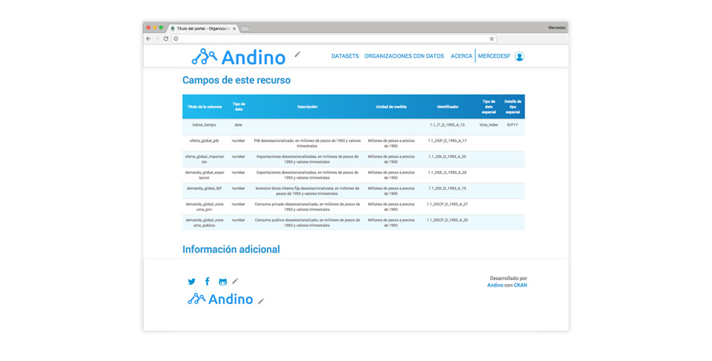</center>

#### Buenas prácticas al cargar campos de un recurso

Puede ser de mucha ayuda para los usuarios que siempre cargues al menos los siguientes campos:
- Título de la columna
- Tipo de dato
- Descripción

También podés usar estos campos para documentar aspectos más avanzados de las columnas de un recurso:
- Unidad de medida
- Identificador
- Tipo de dato especial
- Detalle de tipo especial

***

### Series de tiempo

Andino permite documentar recursos que publican **series de tiempo**. Un recurso con series de tiempo es un [archivo CSV de determinada estructura](https://datosgobar.github.io/paquete-apertura-datos/guia-metadatos/#series-de-tiempo).

#### ¿Cómo documento una serie de tiempo?

En el formulario de carga de un recurso vas a encontrar campos avanzados y especiales que necesitás usar para documentar las columnas de una tabla que contiene series de tiempo.

Los campos **Tipo de dato especial** y **Detalle de tipo especial** te permiten marcar la columna del índice de tiempo y qué frecuencia tiene. 

* **Tipo de dato especial**: marcar la columna que tiene las fechas como "Indice de tiempo".
* **Detalle de tipo de dato especial**: especificar la frecuencia del índice (anual, diaria, mensual, etc).

<center>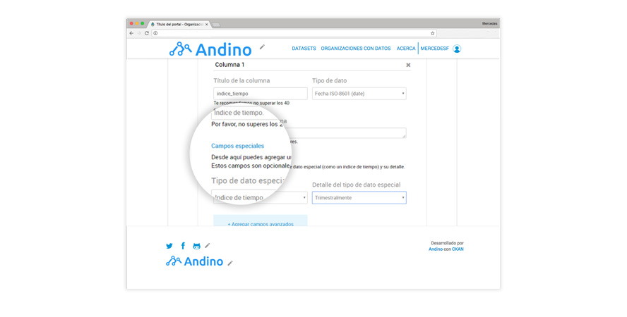</center>

Los campos **Unidad de medida** e **Identificador** te permiten documentar cada una de las columnas, que son tus series de tiempo.

* **Unidad de medida**: es la unidad de medida en que está expresada la serie ("Millones de pesos corrientes", "Kilómetros", "Millones de dólares americanos")
* **Identificador**: es un identificador único de la serie para toda la APN. Debe ser inmutable en el tiempo para la serie, no muy largo (entre 6 y 20 caracteres aproximadamente) y no pisarse potencialmente con otras series de la Administración Pública Nacional.

<center>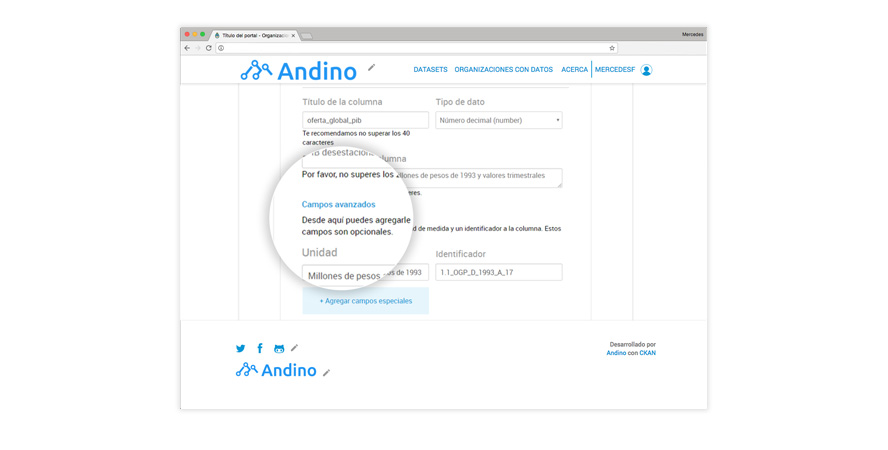</center>

Para conocer más sobre series de tiempo mirá la [documentación completa](https://datosgobar.github.io/paquete-apertura-datos/guia-metadatos/#series-de-tiempo) en el perfil de metadatos.

***

### Etiquetas

Son las palabras que ayudan a los usuarios a filtrar y encontrar los datasets. Cuanto más amplia y uniforme sea la lista de Etiquetas, mayor es su poder de ayuda. 

##### ¿Dónde las veo en el portal?

En cada dataset específico. 

<center>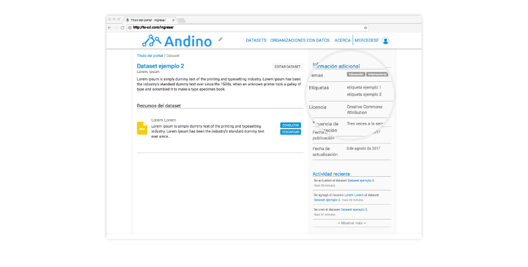</center>

##### Buenas prácticas al crear etiquetas

* Usá mayúsculas sólo donde corresponda.
* Identificá palabras claves.
* Respetá las etiquetas anteriores.
* Agregá sinónimos y usá lenguaje natural.
* Tratá de usar una sola palabra, siempre en plural.
* Si la etiqueta tiene más de una palabra, separalas por un espacio. Por ejemplo: "declaraciones juradas".

Éstas son algunas preguntas útiles a la hora de pensar las etiquetas:

* ¿Cuál es el tema?
* ¿Qué aspectos serán de interés para los usuarios?
* ¿De qué otro modo buscaría el usuario esta información?
* ¿De qué tipo de información se trata?
* ¿Qué área la provee?

#####  ¿Cómo las creo?

Al igual que con los Temas, cada vez que generes un nuevo dataset, el formulario te pedirá que asignes un etiqueta. Recordá siempre reutilizar las que ya hayas creado y no repetirlas.  

<center>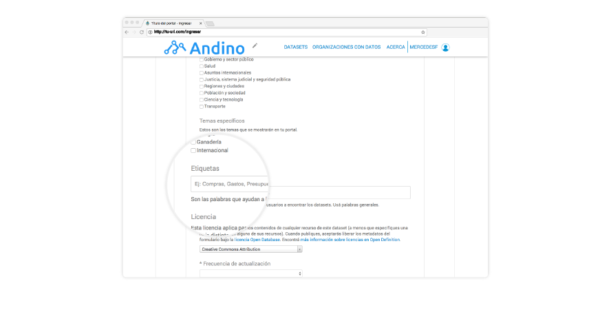</center>

***

### Personalizar el portal

Hacer que tu portal represente tu organización es muy fácil. Por favor, **andá a la Página principal > Configuración**. Llegarás a la sección que te permite cambiar cómo luce la portada de tu catálogo de datos y cada sección en particular.

<center>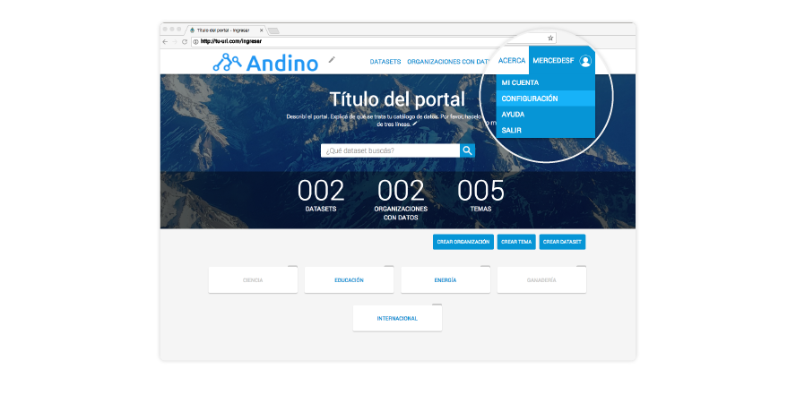</center>

***

## Integrar Andino con Google Analytics

Por favor, [escribinos](mailto:datos@modernizacion.gob.ar) y contanos con qué casilla de e-mail querés tener permisos para ver las métricas de tu Andino. 

***

## Consultas sobre Andino

**Andino es un portal abierto en constante desarrollo** para ser usado por toda la comunidad de datos. Por eso, cuando incorporamos una nueva mejora, **cuidamos mucho su compatibilidad con la versión anterior**.

Como la comunidad de datos es grande, **por ahora no podemos dar soporte técnico frente a modificaciones particulares del código**. Sin embargo, **podés contactarnos para despejar dudas**. 

Te invitamos a crear issues o enviarnos sugerencias en caso de que encuentren algún _bug_ o _tengas feedback_. También podés mandarnos tu comentario o consulta a datos@modernizacion.gob.ar
 
***

## Otros contenidos útiles

* <a href="https://datosgobar.github.io/paquete-apertura-datos/guia-metadatos/" target="_blank">Guía para el uso y la publicación de metadatos</a>
* <a href="https://datosgobar.github.io/paquete-apertura-datos/guia-interoperables/" target="_blank">Guía para la identificación y uso de entidades interoperables</a>
* <a href="https://datosgobar.github.io/paquete-apertura-datos/guia-abiertos/" target="_blank">Guía para la publicación de datos en formatos abiertos</a>
