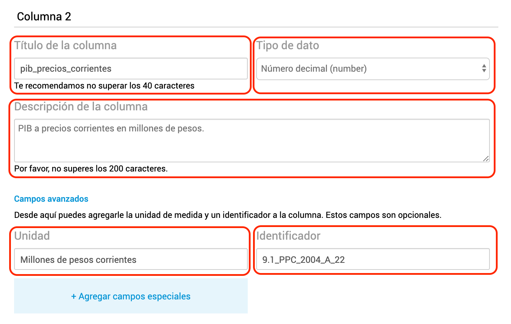

# Publicar series de tiempo

Andino permite documentar archivos CSV como series de tiempo (indicadores con evolución temporal) para que aparezcan en la [API de Series de Tiempo](https://apis.datos.gob.ar/series) y en el [Explorador de Series de Tiempo](https://datos.gob.ar/series).

<!-- START doctoc generated TOC please keep comment here to allow auto update -->
<!-- DON'T EDIT THIS SECTION, INSTEAD RE-RUN doctoc TO UPDATE -->
## Indice

- [1. Crear una distribución de series de tiempo](#1-crear-una-distribucion-de-series-de-tiempo)
    - [Fechas en formato  `YYYY-MM-DD`](#fechas-en-formato-yyyy-mm-dd)
    - [Fecha más antigua primero a la más reciente al final](#fecha-mas-antigua-primero-a-la-m%C3%A1s-reciente-al-final)
    - [Fechas continuas](#fechas-continuas)
    - [Fecha inicial del período](#fecha-inicial-del-periodo)
    - [Usar "," como separador de columnas](#usar-como-separador-de-columnas)
    - [Usar "." como separador decimal](#usar-como-separador-decimal)
    - [No usar separador de miles](#no-usar-separador-de-miles)
- [2. Documentar la distribución en Andino](#2-documentar-la-distribucion-en-andino)
    - [A. Crear o editar el dataset que contendrá al recurso](#a-crear-o-editar-el-dataset-que-contendra-al-recurso)
    - [B. Agregar un nuevo recurso y documentar sus metadatos usuales](#b-agregar-un-nuevo-recurso-y-documentar-sus-metadatos-usuales)
    - [C. Documentar el índice de tiempo](#c-documentar-el-indice-de-tiempo)
    - [D. Documentar las series de tiempo](#d-documentar-las-series-de-tiempo)
- [3. Dar aviso a Datos Argentina](#3-dar-aviso-a-datos-argentina)
- [4. Activar el explorador de series en tu Andino](#4-activar-el-explorador-de-series-en-tu-andino)

<!-- END doctoc generated TOC please keep comment here to allow auto update -->

## 1. Crear una distribución de series de tiempo

Una distribución de series de tiempo es un archivo CSV donde la primer columna contiene las fechas y cada una de las otras columnas es una serie de tiempo.

Así se ve una tabla de series de tiempo en una planilla de cálculo como Excel, Libre Office o Google Spreadsheet:

<table>
  <tr>
    <th>indice_tiempo</th>
    <th>oferta_global_pib</th>
    <th>oferta_global_importacion</th>
    <th>demanda_global_exportacion</th>
    <th>demanda_global_ibif</th>
    <th>demanda_global_consumo_priv</th>
  </tr>
  <tr>
    <td>1993-01-01</td>
    <td>236520.0336</td>
    <td>22027.59999</td>
    <td>16340.95975</td>
    <td>45069.41348</td>
    <td>31952.717</td>
  </tr>
  <tr>
    <td>1994-01-01</td>
    <td>250307.886</td>
    <td>26682.25975</td>
    <td>18840.403</td>
    <td>51231.4255</td>
    <td>32094.804</td>
  </tr>
  <tr>
    <td>1995-01-01</td>
    <td>243186.1018</td>
    <td>24065.62925</td>
    <td>23084.79625</td>
    <td>44528.27725</td>
    <td>32338.89925</td>
  </tr>
  <tr>
    <td>1996-01-01</td>
    <td>256626.244</td>
    <td>28284.11475</td>
    <td>24850.043</td>
    <td>48483.8615</td>
    <td>33040.55475</td>
  </tr>
  <tr>
    <td>1997-01-01</td>
    <td>277441.3173</td>
    <td>35884.496</td>
    <td>27876.14225</td>
    <td>57047.5</td>
    <td>34104.32325</td>
  </tr>
  <tr>
    <td>1998-01-01</td>
    <td>288123.3068</td>
    <td>38903.79175</td>
    <td>30837.53425</td>
    <td>60780.6695</td>
    <td>35249.1645</td>
  </tr>
  <tr>
    <td>1999-01-01</td>
    <td>278369.0138</td>
    <td>34520.59125</td>
    <td>30448.89575</td>
    <td>53116.3155</td>
    <td>36173.34075</td>
  </tr>
</table>

La tabla puede ser generada con un software de planilla de cálculo, una rutina programada o incluso a mano con un editor de texto! Pero en cualquier caso tenés que guardarla como un archivo CSV:

```
indice_tiempo,oferta_global_pib,oferta_global_importacion,demanda_global_exportacion,demanda_global_ibif,demanda_global_consumo_priv
1993-01-01,236520.033577,22027.5999938,16340.9597519,45069.4134803,31952.717001
1994-01-01,250307.886,26682.25975,18840.403,51231.4255,32094.804
1995-01-01,243186.10175,24065.62925,23084.79625,44528.27725,32338.89925
1996-01-01,256626.244,28284.11475,24850.043,48483.8615,33040.55475
1997-01-01,277441.31725,35884.496,27876.14225,57047.5,34104.32325
1998-01-01,288123.30675,38903.79175,30837.53425,60780.6695,35249.1645
1999-01-01,278369.01375,34520.59125,30448.89575,53116.3155,36173.34075
```

**Es muy importante que el archivo CSV cumpla con estas condiciones:**

### Fechas en formato  `YYYY-MM-DD`

El índice de tiempo debe tener las fechas en formato  `YYYY-MM-DD`. Este es el estándar ISO 8601.

Por ejemplo: 12/03/2001 no está soportado, debe escribirse 2001-03-12.

!!! note "Fechas estandarizadas en planillas de cálculo"

    Las planillas de cálculo suelen leer de distintas maneras las fechas y a veces es difícil controlar en qué formato se guardan cuando "exportás a CSV" o "guardás como CSV". El mejor consejo: seleccioná la columna completa que va a ser el índice de tiempo, asignale un formato de "Texto" y escribí las fechas después, como cadenas de texto (así evitás que la planilla de cálculo las lea como fechas).

### Fecha más antigua primero a la más reciente al final

El indice de tiempo debe comenzar por la fecha más antigua y terminar por la más reciente. Menor a mayor, orden ascendente.

<table>
  <tr>
    <th style="background-color: green">indice_tiempo_correcto</th>
    <th style="background-color: red">indice_tiempo_incorrecto</th>
  </tr>
  <tr>
    <td>1993-01-01</td>
    <td>1999-01-01</td>
  </tr>
  <tr>
    <td>1994-01-01</td>
    <td>1998-01-01</td>
  </tr>
  <tr>
    <td>1995-01-01</td>
    <td>1997-01-01</td>
  </tr>
  <tr>
    <td>1996-01-01</td>
    <td>1996-01-01</td>
  </tr>
  <tr>
    <td>1997-01-01</td>
    <td>1995-01-01</td>
  </tr>
</table>

### Fechas continuas

Al índice de tiempo no le pueden faltar valores intermedios. Si no hay datos de una serie para determinado período, debe estar la celda en blanco.

<table>
  <tr>
    <th style="background-color: green">indice_tiempo_correcto</th>
    <th style="background-color: red">indice_tiempo_incorrecto</th>
  </tr>
  <tr>
    <td>1993-01-01</td>
    <td>1993-01-01</td>
  </tr>
  <tr>
    <td>1994-01-01</td>
    <td>1994-01-01</td>
  </tr>
  <tr>
    <td>1995-01-01</td>
    <td>1997-01-01</td>
  </tr>
  <tr>
    <td>1996-01-01</td>
    <td>1998-01-01</td>
  </tr>
  <tr>
    <td>1997-01-01</td>
    <td>1999-01-01</td>
  </tr>
</table>

### Fecha inicial del período

Para representar períodos más largos que una fecha (el caso de todas las frecuencias de tiempo más bajas que la diaria) debe usarse siempre la **fecha completa del comienzo del período**.

**Mensual**

<table>
  <tr>
    <th style="background-color: green">indice_tiempo_correcto</th>
    <th style="background-color: red">indice_tiempo_incorrecto</th>
  </tr>
  <tr>
    <td>1980-01-01</td>
    <td>1980-01-31</td>
  </tr>
  <tr>
    <td>1980-02-01</td>
    <td>1980-02-28</td>
  </tr>
  <tr>
    <td>1980-03-01</td>
    <td>1980-03-31</td>
  </tr>
</table>

**Trimestral**

<table>
  <tr>
    <th style="background-color: green">indice_tiempo_correcto</th>
    <th style="background-color: red">indice_tiempo_incorrecto</th>
  </tr>
  <tr>
    <td>1980-01-01</td>
    <td>1980-02-01</td>
  </tr>
  <tr>
    <td>1980-04-01</td>
    <td>1980-05-01</td>
  </tr>
  <tr>
    <td>1980-07-01</td>
    <td>1980-08-01</td>
  </tr>
  <tr>
    <td>1980-10-01</td>
    <td>1980-11-01</td>
  </tr>
</table>

**Semestral**

<table>
  <tr>
    <th style="background-color: green">indice_tiempo_correcto</th>
    <th style="background-color: red">indice_tiempo_incorrecto</th>
    <th style="background-color: red">indice_tiempo_incorrecto</th>
  </tr>
  <tr>
    <td>1980-01-01</td>
    <td>1980-01-01</td>
    <td>1980-01-31</td>
  </tr>
  <tr>
    <td>1980-07-01</td>
    <td>1980-08-01</td>
    <td>1980-07-31</td>
  </tr>
  <tr>
    <td>1981-01-01</td>
    <td>1981-01-01</td>
    <td>1981-01-31</td>
  </tr>
</table>

### Usar "," como separador de columnas

Las columnas del CSV deben estar separadas con ",". No con ";", "|" ni ningún otro caracter.

<span class="recomendado">**Correcto**</span>
```
indice_tiempo,oferta_global_pib,oferta_global_importacion,demanda_global_exportacion,demanda_global_ibif,demanda_global_consumo_priv
1993-01-01,236520.033577,22027.5999938,16340.9597519,45069.4134803,31952.717001
1994-01-01,250307.886,26682.25975,18840.403,51231.4255,32094.804
1995-01-01,243186.10175,24065.62925,23084.79625,44528.27725,32338.89925
```

<span class="no-recomendado">**Incorrecto**</span>
```
indice_tiempo;oferta_global_pib;oferta_global_importacion;demanda_global_exportacion;demanda_global_ibif;demanda_global_consumo_priv
1993-01-01;236520.033577;22027.5999938;16340.9597519;45069.4134803;31952.717001
1994-01-01;250307.886;26682.25975;18840.403;51231.4255;32094.804
1995-01-01;243186.10175;24065.62925;23084.79625;44528.27725;32338.89925
```

### Usar "." como separador decimal

Los números decimales deben usar "." como separador decimal. No usar ",".

<span class="recomendado">**Correcto**</span>
```
indice_tiempo,oferta_global_pib,oferta_global_importacion,demanda_global_exportacion,demanda_global_ibif,demanda_global_consumo_priv
1993-01-01,236520.033577,22027.5999938,16340.9597519,45069.4134803,31952.717001
1994-01-01,250307.886,26682.25975,18840.403,51231.4255,32094.804
1995-01-01,243186.10175,24065.62925,23084.79625,44528.27725,32338.89925
```

<span class="no-recomendado">**Incorrecto**</span>
```
indice_tiempo,oferta_global_pib,oferta_global_importacion,demanda_global_exportacion,demanda_global_ibif,demanda_global_consumo_priv
1993-01-01,"236520,033577","22027,5999938","16340,9597519","45069,4134803","31952,717001"
1994-01-01,"250307,886","26682,25975","18840,403","51231,4255","32094,804"
1995-01-01,"243186,10175","24065,62925","23084,79625","44528,27725","32338,89925"
```

### No usar separador de miles

Los números decimales no deben usar separador de miles.

<span class="recomendado">**Correcto**</span>
```
indice_tiempo,oferta_global_pib,oferta_global_importacion,demanda_global_exportacion,demanda_global_ibif,demanda_global_consumo_priv
1993-01-01,236520.033577,22027.5999938,16340.9597519,45069.4134803,31952.717001
1994-01-01,250307.886,26682.25975,18840.403,51231.4255,32094.804
1995-01-01,243186.10175,24065.62925,23084.79625,44528.27725,32338.89925
```

<span class="no-recomendado">**Incorrecto**</span>
```
indice_tiempo,oferta_global_pib,oferta_global_importacion,demanda_global_exportacion,demanda_global_ibif,demanda_global_consumo_priv
1993-01-01,"236,520.033577","22,027.5999938","16,340.9597519","45,069.4134803","31,952.717001"
1994-01-01,"250,307.886","26,682.25975","18,840.403","51,231.4255","32,094.804"
1995-01-01,"243,186.10175","24,065.62925","23,084.79625","44,528.27725","32,338.89925"
```

!!! note "Separador de miles al exportar planilla de cálculo a CSV"
    
    Algunas planillas de cálculo (como Excel en algunas versiones) exportan a CSV agregando el separador de miles si el usuario eligió un formato de visualización de número que lo incluye. Para evitarlo, seleccionar las columnas que contienen las series y **elegir un formato de visualización de número sin separador de miles**.


## 2. Documentar la distribución en Andino

Una vez que creaste el CSV, es hora de cargarlo y documentarlo en Andino.

### A. Crear o editar el dataset que contendrá al recurso

Si no creaste el Dataset que contendrá el nuevo recurso/distribución de series de tiempo, tenés que crear un nuevo Dataset. Si el Dataset ya existe, sólo tenés que agregar un nuevo recurso.

### B. Agregar un nuevo recurso y documentar sus metadatos usuales

Documentar un recurso de series de tiempo es igual que documentar cualquier otro recurso, hasta que llegues a la sección "**Documentación de los campos del recurso**".

!!! note "Subir archivo, o copiar URL de descarga"

    Recordá que podés **cargar el archivo directamente en Andino** o podés cargarlo en cualquier otro sistema, y **cargar la URL de descarga en Andino**.

    

    Esto puede ser útil si el CSV se genera automáticamente en otro sistema y se publica en línea. También podés [cargar el archivo a Andino por API](https://docs.ckan.org/en/2.7/maintaining/filestore.html).

### C. Documentar el índice de tiempo

Una vez que llegás a la sección "**Documentación de los campos del recurso**", tenés que documentar la primer columna del CSV: el **índice de tiempo**.


* **Título de la columna**: debe ser exactamente el mismo título que tiene en el CSV. Ej.: *indice_tiempo*.
* **Tipo de dato**: debe ser *"Fecha ISO-8601 (date)"*. Indica a la aplicación que los valores del campo son fechas estandarizadas.
* **Tipo de dato especial**: debe elegirse *"Índice de tiempo"* en el selector. Indica a la aplicación que el campo cumple con todas las propiedades de un índice de tiempo, tal como se explicó en la sección anterior.
* **Detalle del tipo de datos especial**: debe seleccionarse la frecuencia del índice de tiempo.

### D. Documentar las series de tiempo

El resto de las columnas a documentar son las series de tiempo.



* **Título de la columna**: debe ser exactamente el mismo título que tiene en el CSV. Ej.: *pib_precios_corrientes*. **No puede superar los 60 caracteres** en ningún caso.
* **Tipo de dato**: puede ser *"Número decimal (number)"* o *"Número entero (integer)"*. Las series sólo pueden tener números enteros o decimales como valores.
* **Descripción de la columna**: es el metadato más importante por el cual los usuarios van a buscar esa serie. La descripción no debe dejar lugar a dudas de qué serie se trata y conviene que siga una estructura común. Ej.: *"Indice de Precios al Consumidor. Nivel General Nacional. Base diciembre 2016."*
* **Unidad**: es la unidad de medida en que están expresados los valores numéricos de la serie. Ej.: *"Millones de pesos de 2004"*, *"Kilogramos"* o *"Millones de USD corrientes"*
* **Identificador**: es el código que identifica unívocamente a la serie dentro de toda la base de series de tiempo de la Administración Pública Nacional. Debe pensarse de forma que no sea muy largo pero no pueda pisarse con otras series: *"ipc"* es un mal código, mientras que *"ipc_0001"* es mejor. Conviene decidir una estructura o convención para generar los códigos de las series del organismo y ceñirse a ella.

## 3. Dar aviso a Datos Argentina

Una vez que documentaste un nuevo recurso de series de tiempo, escribinos a [datosargentina@jefatura.gob.ar](mailto:datosargentina@jefatura.gob.ar) para que lo federemos en la API y te ayudemos a resolver cualquier problema!

A partir de que se federa por primera vez, la API revisará automáticamente 4 veces por día el archivo CSV y los metadatos para reflejar cualquier cambio que hagas.

## 4. Activar el explorador de series en tu Andino

Las series federadas en la API también se pueden ver en tu Andino, activando el explorador de series.


* Tildar el casillero *¿Querés que esta sección se vea en tu portal?*
* Elegir series destacadas en *¿Querés destacar algunas series?* escribiendo los identificadores de las series separados por comas ",".

Si sos un organismo de la Administración Pública Nacional de Argentina, el campo *URI de la API de Series* no debe modificarse! Si desplegaste una instancia propia de la [aplicación de la API](https://github.com/datosgobar/series-tiempo-ar-api) podés cambiar la URL a donde apunta Andino.
